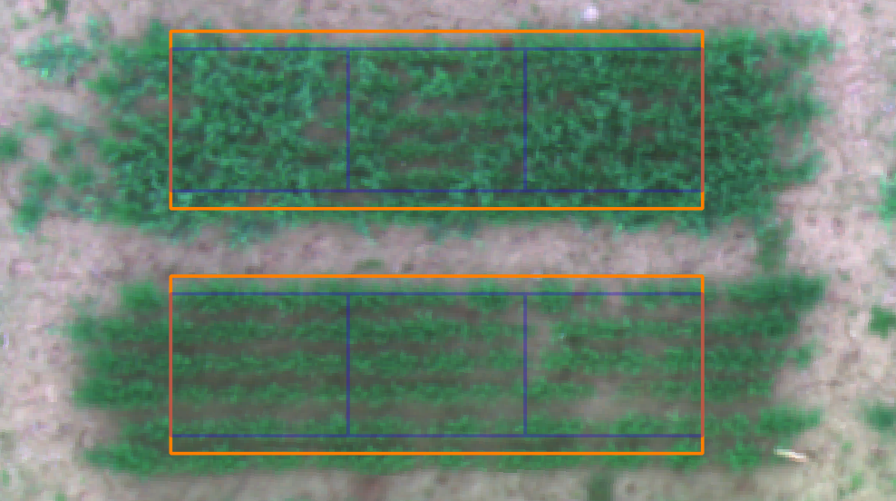

```{r setup, include=FALSE}
knitr::opts_chunk$set(echo = TRUE,message = FALSE)


```

<br> <br>

### Library

```{r}
library(readxl)
library(readr)
library(tidyverse)
library(lme4)
library(kableExtra)

```

<br> <br>

### Import NDVI data generated in QGIS

The NDVI data files are exported from QGIS with a NDVI value for each
supbplot. The prow, pcol, grow, and gcol are identifiers from the
`plot boundary` and `plot grid` plugin. The
*plot_number_to_plot_boundary* files is used to link the plot id's of
the NDVI files with the plot id's of the T3/oat data file.

```{r}
NDVI_10_17_23 <- read_excel("data/NDVI_10-17-23.xlsx")
NDVI_11_16_23 <- read_excel("data/NDVI_11-16-23.xlsx")
NDVI_04_01_24 <- read_excel("data/NDVI_04-01-24.xlsx")
NDVI_04_20_24 <- read_excel("data/NDVI_04-20-24.xlsx")
NDVI_05_12_24 <- read_excel("data/NDVI_05-12-24.xlsx")
NDVI_06_14_24 <- read_excel("data/NDVI_06-14-24.xlsx")
NDVI_07_08_24 <- read_excel("data/NDVI_07-08-24.xlsx")

plot_number_to_plot_boundary <- read_csv("output/plot_number_to_plot_boundary.csv")
```

<br>

### Import phenotype data

*Cornell_WinterOatPeaIntercrop_2024_Ithaca* is the trial name and
phenotype data downloaded from T3/Oat with no changes made.
*Cornell_WinterOatPeaIntercrop_2024_Ithaca_plot_meta* contains plot meta
data not available on T3/Oat. Along with T3/Oat unique plot id's for
merging. It is mostly used for inter-crop designations.

```{r}
Cornell_WinterOatPeaIntercrop_2024_Ithaca <- read_csv("data/Cornell_WinterOatPeaIntercrop_2024_Ithaca.csv")

Cornell_WinterOatPeaIntercrop_2024_Ithaca_plot_meta <- read_excel("data/Cornell_WinterOatPeaIntercrop_2024_Ithaca_plot_meta.xlsx")
```

```{r,echo=FALSE}
Cornell_WinterOatPeaIntercrop_2024_Ithaca
```


```{r,echo=FALSE}
Cornell_WinterOatPeaIntercrop_2024_Ithaca_plot_meta  %>% 
  kable(align = "c") %>% 
  kable_classic(full_width=F,position = "left")%>% 
  scroll_box(width = "900px", height = "300px")
```

<br> <br>

### NDVI calculations

<br> The orange rectangle is the plot boundary. The plot is divided into
3 subplots. Mean NDVI was calculated for each subplot in QGIS. For
analysis the middle subplot (subplot 2) was used because it was never
biomass harvested and represents the portion of the plot that was
harvested for grain yield. The subplot delineation was buffered in 10cm
on either side. This allows for a more automated workflow by alleviating
then need to shift each plot boundary.

 <br>

### Format the NDVI Data

The NDVI data for each date is combined and the T3/oat plot number is
assigned. Some guard plots and filler plots have values calculated in
QGIS there plots are identified as 900's and will be removed.

```{r}
ndvi <- bind_cols(

NDVI_10_17_23[,1:4],

NDVI_10_17_23[,7],
NDVI_11_16_23[,7],
NDVI_04_01_24[,7],
NDVI_04_20_24[,7],
NDVI_05_12_24[,7],
NDVI_06_14_24[,7],
NDVI_07_08_24[,7]
)

ndvi <- ndvi %>% 
  mutate(pg_id = str_c(prow,"_",pcol,"_",grow,"_",gcol)) %>% 

  left_join(plot_number_to_plot_boundary %>% 
              mutate(pg_id = str_c(prow,"_",pcol,"_",grow,"_",gcol)) %>% 
              select(plot_number,subplot,pg_id)) %>% 
  relocate(plot_number,subplot,pg_id)

```

```{r,echo=FALSE}

ndvi%>% 
  kable(align = "c") %>% 
  kable_classic(full_width=F,position = "left")%>% 
  scroll_box(width = "900px", height = "300px")

```

<br> <br>

### Format and calculations of phenotype data.

Set up of the T3/oat data file for use in this analysis.

1.  join with meta data

2.  calculate total yield

3.  select desired columns

4.  filter out sub-plot data

5.  filter out other unwanted plots

```{r}

plot_data <- Cornell_WinterOatPeaIntercrop_2024_Ithaca %>% 
  mutate("plot_name" = if_else(observationLevel == "subplot",str_sub(observationUnitName,end = -11), observationUnitName)) %>% 
  left_join(Cornell_WinterOatPeaIntercrop_2024_Ithaca_plot_meta,join_by(plot_name) ) %>% 
  
  rowwise() %>% 
  mutate(pea_yield = if_else(inter_crop == "pea",
                             sum(`Grain yield - g/m2|CO_350:0000260`,`Pea grain yield - g/m2|COMP:0000049`,na.rm=TRUE),`Pea grain yield - g/m2|COMP:0000049` )) %>% 
  mutate(oat_yield = if_else(inter_crop == "oat",
                             sum(`Grain yield - g/m2|CO_350:0000260`,`Pea grain yield - g/m2|COMP:0000049`,na.rm=TRUE),`Grain yield - g/m2|CO_350:0000260` )) %>% 
  mutate(pea_yield = if_else(inter_crop == "oat", 0 , pea_yield )) %>% 
  mutate(oat_yield = if_else(inter_crop == "pea", 0 , oat_yield )) %>% 
  mutate("total_yield" = oat_yield+pea_yield) %>% 
  
  select(observationLevel,observationUnitDbId,inter_crop ,source,
         replicate,plotNumber,germplasmName, inter_crop,
         oat_yield,
         pea_yield,
         total_yield,
         `Lodging severity - 0-9 Rating|CO_350:0005007`,
         `Freeze damage severity - 0-9 Rating|CO_350:0005001`,
         `Winter survival - percent|CO_350:0000170`) %>% 
  
  filter(observationLevel == "plot") %>% 
  filter(source != "Barley") %>% 
  filter(source != "Martens") 

plot_data
```

<br> <br>

### Join the NDVI and T3/Oat data

1.  filter and keep only sublot 2, the middle subplot
2.  join the NDVI data with T3/data
3.  calculate cumulative NDVI **cNDVI**

```{r}
ndvi_s2 <- ndvi %>% 
  filter(gcol == 2) #for yield, NDVI analysis I'm only using NDVI values from subplot 2 because they represent the actual grain harvested area, and they were never biomass sampled which would be problematic for the cNDVI

cNDVI_plot_data <- plot_data %>% 
  select(plotNumber,germplasmName,replicate,inter_crop,oat_yield,pea_yield,total_yield) %>% 
  left_join(ndvi_s2, by=join_by(plotNumber == plot_number)) %>% 
  mutate(cNDVI = rowSums(across(`NDVI_10-17-23_mean`:`NDVI_07-08-24_mean`)))  
  
cNDVI_plot_data
```

```{r}
cNDVI_plot_data %>% 

 ggplot(aes(cNDVI,total_yield,color=inter_crop))+
  geom_point() +
  geom_smooth(se = FALSE, method = lm)+
  xlab("cNDVI")+
  ylab("Total Grain g")+
  scale_color_brewer(palette="Dark2")+
  theme_classic()+
  theme(axis.text.x=element_text(angle = 90, hjust = 1))+
  theme(axis.text=element_text(size=20), axis.title=element_text(size=20,face="bold"))+
  theme(axis.text.x = element_text(face = "bold", color = "black", size = 16))+
  theme(axis.text.y = element_text(face = "bold", color = "black", size = 16))

```

<br> <br>

### NDVI Time Series

```{r}

ndvi_s2.1 <- ndvi_s2 %>% 
  filter(gcol == 2) %>% 
  select(plot_number,`NDVI_10-17-23_mean`:`NDVI_07-08-24_mean`)

time_series_plot_data <- plot_data %>% 
  select(plotNumber,germplasmName,replicate,inter_crop,oat_yield,pea_yield,total_yield,`Freeze damage severity - 0-9 Rating|CO_350:0005001`) %>% 
  left_join(ndvi_s2.1, by=join_by(plotNumber == plot_number)) 

dap_names <- c("plotNumber","germplasmName","replicate",
               "inter_crop","oat_yield","pea_yield","total_yield","freeze",
               13,43,180,199,221,254,278)

names = c(colnames(time_series_plot_data))

colnames(time_series_plot_data) <- dap_names


```

```{r}

time_series_plot_data %>% 
  pivot_longer(`13`:`278`, names_to = "dap", values_to = "ndvi" ) %>% 
  mutate(dap = as.numeric(dap)) %>%

 ggplot(aes(dap,ndvi,color=inter_crop))+
  geom_jitter() +
  stat_summary(fun = "mean", geom="line",linewidth=1)+
  xlab("DAP")+
  ylab("NDVI")+
  scale_color_brewer(palette="Dark2")+
  theme_classic()+
  theme(axis.text.x=element_text(angle = 90, hjust = 1))+
  theme(axis.text=element_text(size=20), axis.title=element_text(size=20,face="bold"))+
  theme(axis.text.x = element_text(face = "bold", color = "black", size = 16))+
  theme(axis.text.y = element_text(face = "bold", color = "black", size = 16))


```

<br>
Notes:
  The peas start out slow and catch up.
  NDVI at the last time point is very similar to the first.  Indicating complete senescence.
  In the field it was clear that peas matured a week or two after the oats.  It is important to breed for better maturity timing and this might be useful to help make the selection. 
  This graph is way to over smoothed but is the decrease in NDVI over the winter indicative of winter survival.


<br> <br>

### NDVI at peak timepoint

```{r}
plot_data %>% 
  select(plotNumber,germplasmName,replicate,inter_crop,oat_yield,pea_yield,total_yield) %>% 
  left_join(ndvi_s2, by=join_by(plotNumber == plot_number)) %>% 
  mutate(cNDVI = rowSums(across(`NDVI_10-17-23_mean`:`NDVI_07-08-24_mean`))) %>% 
  
  ggplot(aes(`NDVI_06-14-24_mean`,total_yield,color=inter_crop))+
  geom_point() +
  geom_smooth(se = FALSE, method = lm)+
  xlab("NDVI_06-14-24")+
  ylab("Total Grain g")+
  scale_color_brewer(palette="Dark2")+
  theme_classic()+
  theme(axis.text.x=element_text(angle = 90, hjust = 1))+
  theme(axis.text=element_text(size=20), axis.title=element_text(size=20,face="bold"))+
  theme(axis.text.x = element_text(face = "bold", color = "black", size = 16))+
  theme(axis.text.y = element_text(face = "bold", color = "black", size = 16))
```
<br>
Notes:
  *Total Grain g* is the sum of the oat and pea grain harvested.  
  6-14-24 is the peak NDVI time point and appears to have to most correlation to yield.
  
  
<br> <br>

```{r}
plot_data %>% 
  select(plotNumber,germplasmName,replicate,inter_crop,oat_yield,pea_yield,total_yield) %>% 
  left_join(ndvi_s2, by=join_by(plotNumber == plot_number)) %>% 
  mutate(cNDVI = rowSums(across(`NDVI_10-17-23_mean`:`NDVI_07-08-24_mean`))) %>% 
  
  ggplot(aes(`NDVI_11-16-23_mean`,total_yield,color=inter_crop))+
  geom_point() +
  geom_smooth(se = FALSE, method = lm)+
  xlab("NDVI_11-16-23_mean")+
  ylab("Total Grain g")+
  scale_color_brewer(palette="Dark2")+
  theme_classic()+
  theme(axis.text.x=element_text(angle = 90, hjust = 1))+
  theme(axis.text=element_text(size=20), axis.title=element_text(size=20,face="bold"))+
  theme(axis.text.x = element_text(face = "bold", color = "black", size = 16))+
  theme(axis.text.y = element_text(face = "bold", color = "black", size = 16))


```
<br>
Notes:
  11-16-23 is the pre winter time point and does not seem to be correlated to yield. 


<br>


### Oat Genetic Components of Total Yield (GC Yield)

Set up the data
The following only uses inter-crop data. 

```{r}

model_data <- plot_data %>% 
  select(plotNumber,germplasmName,replicate,inter_crop,oat_yield,pea_yield,total_yield) %>% 
  left_join(ndvi_s2, by=join_by(plotNumber == plot_number)) %>% 
  mutate(cNDVI = rowSums(across(`NDVI_10-17-23_mean`:`NDVI_07-08-24_mean`)))


model_data <- model_data %>% 
  select(germplasmName,replicate,inter_crop,total_yield,`NDVI_10-17-23_mean`:cNDVI) %>% 
  rename(block = replicate) %>% 
  filter(inter_crop == "oat-pea") # select only oat-pea yields

```


```{r, echo=FALSE}
model_data%>% 
  kable(align = "c") %>% 
  kable_classic(full_width=F,position = "left")%>% 
  scroll_box(width = "900px", height = "300px")

```

<br>

Total Yield (oat + pea)

```{r}

yield <- lme4::lmer(total_yield ~ (1|germplasmName) + (1|block),
           data = model_data)


df_trait <- as.data.frame(VarCorr(yield))
vg_trait <- df_trait[df_trait$grp == "germplasmName","vcov"]
ve_trait <- df_trait[df_trait$grp == "Residual", "vcov"]
h2_trait <- vg_trait/(vg_trait + ve_trait/(2))

h2_yield <- h2_trait

h2_yield

```


The heritability of yield


<br>

NDVI

```{r}

ndvi <- lme4::lmer(`NDVI_06-14-24_mean` ~ (1|germplasmName) + (1|block),
                    data = model_data)

df_trait <- as.data.frame(VarCorr(ndvi))
vg_trait <- df_trait[df_trait$grp == "germplasmName","vcov"]
ve_trait <- df_trait[df_trait$grp == "Residual", "vcov"]

h2_trait <- vg_trait/(vg_trait + ve_trait/(2))

h2_ndvi <- h2_trait

h2_ndvi

```

The heritability of NDVI


<br>

Combine GC yield and GC NDVI

```{r}
GC_yield <- ranef(yield)$germplasmName

GC_ndvi <- ranef(ndvi)$germplasmName

GC_yield <- GC_yield %>%
  rownames_to_column(var = "germplasmName")%>% 
  rename(GC_yield = "(Intercept)")


GC_ndvi <- GC_ndvi %>% 
  rownames_to_column(var = "germplasmName")%>% 
  rename(GC_ndvi = "(Intercept)")

```

<br>

```{r}


model_data %>% 
  select(germplasmName,`NDVI_06-14-24_mean`) %>% 
  group_by(germplasmName) %>% 
  summarise(mean_ndvi = mean(`NDVI_06-14-24_mean`)) %>% 
  left_join(GC_yield) %>% 
    ggplot(aes(mean_ndvi,GC_yield))+
    geom_point() +
    geom_smooth(se = FALSE, method = lm)+
    xlab("NDVI_06-14-24")+
    ylab("GC Yield")+
    scale_color_brewer(palette="Dark2")+
    theme_classic()+
    theme(axis.text.x=element_text(angle = 90, hjust = 1))+
    theme(axis.text=element_text(size=20), axis.title=element_text(size=20,face="bold"))+
    theme(axis.text.x = element_text(face = "bold", color = "black", size = 16))+
    theme(axis.text.y = element_text(face = "bold", color = "black", size = 16))

```


```{r}


model_data %>% 
  select(germplasmName,`cNDVI`) %>% 
  group_by(germplasmName) %>% 
  summarise(mean_ndvi = mean(`cNDVI`)) %>% 
  left_join(GC_yield) %>% 
    ggplot(aes(mean_ndvi,GC_yield))+
    geom_point() +
    geom_smooth(se = FALSE, method = lm)+
    xlab("cNDVI")+
    ylab("GC Yield")+
    scale_color_brewer(palette="Dark2")+
    theme_classic()+
    theme(axis.text.x=element_text(angle = 90, hjust = 1))+
    theme(axis.text=element_text(size=20), axis.title=element_text(size=20,face="bold"))+
    theme(axis.text.x = element_text(face = "bold", color = "black", size = 16))+
    theme(axis.text.y = element_text(face = "bold", color = "black", size = 16))

```
<br>
Notes:
*cNDVI* is the NDVI integral or area under the curve. 


<br>
<br>

###  NDVI maturity

```{r}

time_series_plot_data %>% 
  pivot_longer(`13`:`278`, names_to = "dap", values_to = "ndvi" ) %>% 
  mutate(dap = as.numeric(dap)) %>% 
  filter(dap == 221| dap == 254| dap == 278) %>% 
  ggplot(aes(dap,ndvi,color=inter_crop))+
  geom_jitter(width = 3) +
  geom_smooth(se = TRUE)+
  xlab("DAP")+
  ylab("NDVI")+
  scale_color_brewer(palette="Dark2")+
  theme_classic()+
  theme(axis.text.x=element_text(angle = 90, hjust = 1))+
  theme(axis.text=element_text(size=20), axis.title=element_text(size=20,face="bold"))+
  theme(axis.text.x = element_text(face = "bold", color = "black", size = 16))+
  theme(axis.text.y = element_text(face = "bold", color = "black", size = 16))


```


### NDVI winter change

```{r}
time_series_plot_data %>% 
  pivot_longer(`13`:`278`, names_to = "dap", values_to = "ndvi" ) %>% 
  mutate(dap = as.numeric(dap)) %>% 
  filter(dap == 43| dap == 180) %>% 
  ggplot(aes(dap,ndvi,color=inter_crop))+
  geom_jitter(width = 10) +
  geom_smooth(se = TRUE, method = lm)+
  xlab("DAP")+
  ylab("NDVI")+
  scale_color_brewer(palette="Dark2")+
  theme_classic()+
  theme(axis.text.x=element_text(angle = 90, hjust = 1))+
  theme(axis.text=element_text(size=20), axis.title=element_text(size=20,face="bold"))+
  theme(axis.text.x = element_text(face = "bold", color = "black", size = 16))+
  theme(axis.text.y = element_text(face = "bold", color = "black", size = 16))
```
<br>
Notes:
  This graph represents the drop in NDVI over the winter. 


<br>


```{r}

time_series_plot_data %>% 
  mutate(winter_change = `180` - `43`) %>% 
  filter(inter_crop == "oat-pea") %>% 
  ggplot(aes(germplasmName,winter_change))+
  geom_boxplot()+
  xlab("Accession")+
  ylab("NDVI Winter Change")+
  scale_color_brewer(palette="Dark2")+
  theme_classic()+
  theme(axis.text.x=element_text(angle = 90, hjust = 1))+
  theme(axis.text=element_text(size=20), axis.title=element_text(size=20,face="bold"))+
  theme(axis.text.x = element_text( color = "black", size = 8))+
  theme(axis.text.y = element_text(face = "bold", color = "black", size = 16))


```
<br>
Notes:
  Trying to show that there is variation in NDVI winter change due to Accession.

<br>


```{r, warning=FALSE}

## why are there warnings
time_series_plot_data %>%   
    left_join(plot_data, by = "plotNumber") %>% 
  mutate(winter_change = `180` - `43`) %>% 
  filter(inter_crop.x == "oat") %>% 
  mutate(freeze_damage = `Freeze damage severity - 0-9 Rating|CO_350:0005001`) %>% 
  ggplot(aes(`Freeze damage severity - 0-9 Rating|CO_350:0005001`, winter_change))+
    geom_point()+
  geom_smooth()+
  ylab("NDVI Winter Change")+
  scale_color_brewer(palette="Dark2")+
  theme_classic()+
  theme(axis.text.x=element_text(angle = 90, hjust = 1))+
  theme(axis.text=element_text(size=20), axis.title=element_text(size=20,face="bold"))+
  theme(axis.text.x = element_text( color = "black", size = 16))+
  theme(axis.text.y = element_text(face = "bold", color = "black", size = 16))


```
Notes:  Trying to look at the correlation between NDVI winter change and Freeze damage.  Should probably shift to values this graph isn't that useful. 

<br>


###  Heritability of NDVI change and Winter Damage ratings

```{r}

rep_geno_2 <- time_series_plot_data %>%   
  left_join(plot_data, by = "plotNumber") %>% 
  mutate(winter_change = `180` - `43`) %>% 
  filter(inter_crop.x == "oat") %>% 
  select(germplasmName.x, winter_change, replicate.x) %>% 
  group_by(germplasmName.x) %>% 
  count() %>% 
  filter(n == 2)

h2_data <- time_series_plot_data %>%   
  left_join(plot_data, by = "plotNumber") %>% 
  mutate(winter_change = `180` - `43`) %>% 
  filter(inter_crop.x == "oat") %>% 
  select(germplasmName.x, winter_change, replicate.x,freeze) %>% 
  filter(germplasmName.x %in% c(rep_geno_2$germplasmName.x)) %>% 
  rename(germplasmName = germplasmName.x) %>% 
  rename(block = replicate.x)

```

The dataframe
```{r, echo=FALSE}

h2_data %>% 
  kable(align = "c") %>% 
  kable_classic(full_width=F,position = "left")%>% 
  scroll_box(width = "900px", height = "300px")


```


```{r}

lm_trait <- lme4::lmer(winter_change ~ (1|germplasmName) + (1|block),
                       data = h2_data)

df_trait <- as.data.frame(VarCorr(lm_trait))
vg_trait <- df_trait[df_trait$grp == "germplasmName","vcov"]
ve_trait <- df_trait[df_trait$grp == "Residual", "vcov"]

h2_trait <- vg_trait/(vg_trait + ve_trait/(2))

h2_ndvi_winter_change  <- h2_trait


lm_trait <- lme4::lmer(freeze ~ (1|germplasmName) + (1|block),
                       data = h2_data)

df_trait <- as.data.frame(VarCorr(lm_trait))
vg_trait <- df_trait[df_trait$grp == "germplasmName","vcov"]
ve_trait <- df_trait[df_trait$grp == "Residual", "vcov"]

h2_trait <- vg_trait/(vg_trait + ve_trait/(2))

h2_freeze_damage <- h2_trait


```

```{r}

h2_ndvi_winter_change
h2_freeze_damage

```
The heritabiliy of the *freeze damage rating* is greater than the *NDVI winter change*

<br>
<br>
